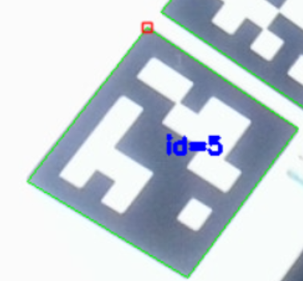
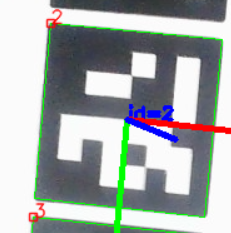

## OpenCV ArUco API基本使用教程

本次比赛中，选手需要实现二维码识别。由于本次比赛使用的是ArUco码，因此下文将简单讲述如何调用API实现ArUco码的识别。

ArUco码是一种由黑色边框和内部二进制矩阵组成的基准标记，可以视作简化版的二维码。ArUco码相比大家见到的二维码有以下优点：

1. 结构简单
  - ArUco码外部有粗黑边框，确保相机即使在不同光照条件也能较好检测到。
  - 内部二进制矩阵，决定了每个ArUco码的唯一ID。
2. OpenCV有预定义的字典
  - ArUco码不是随机生成的，而是来自于一个预定义的字典。每个字典包含数目固定，互不相同的ArUco标记。而每个ArUco标记都与唯一ID一一对应，这也是能够识别出ArUco码ID的基础。（见预赛任务）
3. 可提供姿态信息
  - 一旦相机检测到标记，并且已知标记实际物理尺寸和相机的标定参数（包括内参矩阵和畸变系数），相机就可以计算出相机相对于该标记的精确3D位置和姿态。简单来说，就是能知道相机在标记的哪个方向、距离多远、倾斜角度是多少。

实现一个ArUco码识别的程序，大体可以分为以下几步：

- 选定各类参数，包括：
  - 预定义字典类型（必需）
  - 相机标定参数（可选）
  - 实际物理边长（可选）
  - 初始化ArUco检测器（可选）
- 检测ArUco标记。
- 绘制标记。
- 进行姿态估计。（可选）

如果目标仅仅是识别ArUco码并展示ID，或者仅进行粗略的姿态估计的话，可以不必进行相机参数标定，直接采用一个固定参数即可。（下文会提及）

想要了解更多信息，点击下方：

- [OpenCV ArUco模块文档](https://docs.opencv.org/4.x/d9/d6a/group__aruco.html)
- [检测标记教程](https://docs.opencv.org/4.x/d5/dae/tutorial_aruco_detection.html)
- [姿态估计教程](https://docs.opencv.org/4.x/d5/dae/tutorial_aruco_detection.html)
- [生成标记教程](https://docs.opencv.org/4.x/d5/dae/tutorial_aruco_detection.html)

### ArUco码检测实现（最简单版本，满足预赛要求）

#### 0.导入相关库

ArUco码识别需要使用cv2.aruco库。
```python
import cv2
```

#### 1.选定参数——预定义字典类型

识别ArUco码之前需要预定义字典类型，代码如下：

```python
aurco_dict_type = cv2.aruco.DICT_6X6_250  #注意：此处"X"是大写！
aruco_dict = cv2.aruco.getPredefinedDictionary(aurco_dict_type)
```

不同预定义的字典区别在于：

- 网格类型：如4X4,5X5,6X6,7X7等
- 标记数量：如50,100,250,1000等

#### 2.创建ArUco检测器

首先，获取ArUco检测器参数。
```python
aruco_params = cv2.aruco.DetectorParameters()
```

其次，根据预定义字典和参数创建并初始化ArUco检测器。
```python
aruco_detector = cv2.aruco.ArucoDetector(aruco_dict, aruco_params)
```

#### 3.检测ArUco码

调用检测器的detectMarkers()函数进行检测。
```python
corners, ids, _ = aruco_detector.detectMarkers(image)
```

返回值：
- corners：检测到的角点的列表，其中每个元素包含ArUco码四个角点的坐标。
- ids：数组，其中每个元素是识别到ArUco码对应的ID。
- 第三个参数为rejectedImgPoints，一般不使用，因此在程序中可直接用短下划线"_"代替。

#### 4.绘制结果

drawDetectedMarkers()函数可绘制出每个ArUco标记的四边形边框，并在标记上方显示对应的ID数字。
```python
cv2.aruco.drawDetectedMarkers(image, corners, ids)
```
至此，一个最简单的ArUco码识别并显示ID的任务就完成了。有兴趣继续了解利用ArUco进行姿态估计的同学可以继续阅读。

代码效果图：

<div align="center">

</div>

### 利用ArUco码进行姿态估计

#### 1.确定相机参数与物理边长

进行姿态估计前，需要确定相机参数，包括内参矩阵和畸变系数。如果不追求姿态估计的精度，可以直接照搬下图参数：
```python
cam_matrix = np.array([
            [550.0, 0, 320],    # fx, 0, cx
            [0, 550.0, 240],    # 0, fy,
            [0, 0, 1]           # 0, 0, 1
        ])
dist_coeffs = np.array([0, 0, 0, 0, 0])
# cam_matrix为内参矩阵，dist_coeffs为畸变系数。可以直接假定没有畸变，不过姿态估计精度会有所降低。
```
*注：如果对精度要求较高，则需要进行相机参数的标定。文件夹CameraCalibration下的Calibration.py为相机标定程序。（不过不建议大家运行，该程序计算出的畸变系数似乎有误）*

定义实际物理边长marker_size，边长即为标记边框的实际边长，单位为米(m)。

#### 2.姿态估计

如果orangpi上安装的opencv版本高于4.7.0，则调用solvePnP()计算：
```python
Success, rvec, tvec = cv2.solvePnP(obj_points, current_corners, cam_matrix, dist_coeffs)
```
函数参数：
- obj_points:标记在ArUco坐标系中的角点坐标。
- current_corners:检测到的某个ArUco标记对应的四个角点坐标。
- cam_matrix, dist_coeffs：相机参数。

返回值：
- Success:是否计算成功
- rvec:旋转向量，表示从ArUco坐标系到相机坐标系的旋转。
- tvec:平移向量，表示从ArUco坐标系到相机坐标系的平移。

其中ArUco坐标系以ArUco码中心为原点，标记平面为XY平面，垂直于标记向外的方向为Z轴的正方向。

如果opencv版本低于4.7.0，则调用estimatePoseSingleMarkers()函数：
```python
rvec, tvec, _ = cv2.aruco.estimatePoseSingleMarkers(corners, marker_size, camera_matrix, dist_coeffs)
```
注意：corners是所有ArUco标记对应的所有角点坐标，也就是detectMarkers返回的corners

#### 3.绘制坐标轴

drawFrameAxes()能够对其中一个ArUco标记绘制xyz坐标轴，根据该标记对应的旋转、平移向量。
```python
cv2.drawFrameAxes(image, cam_matrix, dist_coeffs, rvec, tvec, marker_size)
```

至此，姿态估计所需基本函数也介绍完毕。

代码效果图：

<div align="center">

</div>

**ArUco码识别的基础教程就到这里，祝大家比赛顺利！**