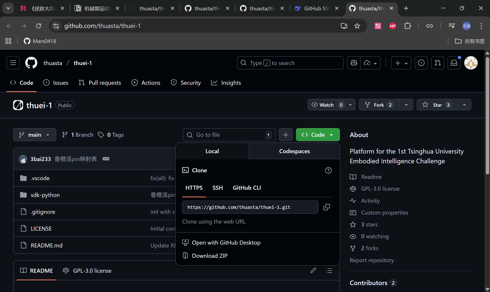
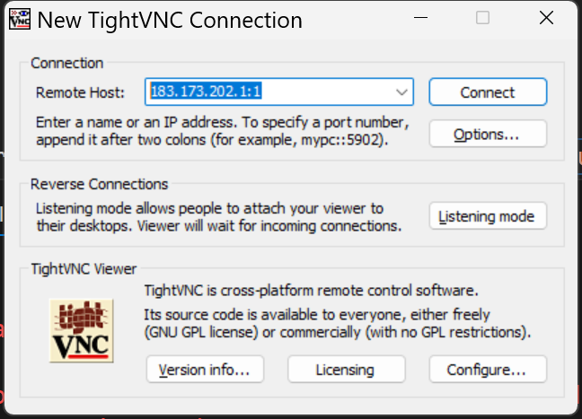

# 智能车机械臂控制教程
---
>该教程无法涵盖小车机械臂控制调试过程中出现的所有情况。
如果按照该教程无法复现结果，或者对其他内容有任何疑问，欢迎在@第二届具身智能挑战赛FAQ 里提出

>本篇教程以thuei-1/sdk-python/Functions/ColorSorting.py为例，
帮助大家在跑通程序的同时理解机械臂控制的基本机制

## 预先准备
---

### 首先一定检查是否做好以下操作：
---

1. 小车的硬件连接**正确无误且稳固**
（猜猜是谁被杜邦线连接不牢硬控一晚上）；

>出现形如`Input/output error`的报错，极可能是硬件的问题，具体见下文“常见问题”

2. 拓展板和香橙派都是开启状态（香橙派亮两个黄灯，拓展板亮红灯）


### 香橙派连接，激活conda环境
---

1. 使用vscode的remote-ssh/MobaXTerm的Session/HDMI连接香橙派

2. 确保以sudo权限（即root用户访问）：打开香橙派的终端，如果显示
    ```
    (base) HwHiAiUser@orangepiaipro-20t:
    ```
    则在终端输入：`sudo -i`，此时可以看到终端显示为
    ```
    (base) root@orangepiaipro-20t:
    ```
    >当然，如果原先使用ssh连接，使用`root@xxx.xxx.xx.xxx`而非`HwHiAiUser@xxx.xxx.xx.xxx`，就不存在此问题

3. 确保已经克隆thuei-1的代码到香橙派上（已经克隆过的同学可以跳过此步骤）
   #### 关于如何将github上的仓库clone到本地/远程连接的设备
   ---
   1. 进入想要克隆的仓库；例如现在我们想要克隆的是[科协的thuei-1仓库](https://github.com/thuasta/thuei-1)
   2. 点击仓库右上方的绿色图标`<> code`，在http一栏下复制仓库的web URL字符串；例如`https://github.com/thuasta/thuei-1.git`(选用ssh一栏的URL下载更快，但前提是你的设备已经保管有ssh-key)
   
   3. 回到你希望克隆到的设备的终端，进入到你希望放置仓库的路径下；此处，因为上一步中我们以root用户访问，所以现在只需要在终端输入`cd ~`，回到root目录下。或者，你也可以右键左边栏的root文件夹，选择`Open in Integrated Terminal`,直接打开一个位于root文件夹的终端 
   5. 输入`git clone [URL_that_you_have_copied]`;例如此处我们输入：
   ```
   git clone https://github.com/thuasta/thuei-1.git
   ```
   6. 显示`Cloning into 'thuei-1'...`等待文件传输好即可


4. 激活masterpi的环境，输入`conda activate masterpi`,可以看到如下变化：

    ```
        (base) root@orangepiaipro-20t:~# conda activate masterpi
        (masterpi)root@orangepiaipro-20t:~#
    ```
    如果输出形如`EnvironmentNameNotFound`的提示,则需要先创建masterpi环境：
    ```
    (base) root@orangepiaipro-20t:~# conda create -n masterpi --copy base 
    ```
    然后按照上文方式激活这个环境

>关于环境管理的知识点，可以回看[培训文档第三讲](https://github.com/thuasta/thuei-2/blob/main/%E5%9F%B9%E8%AE%AD%E6%96%87%E6%A1%A3/3_Camera%20and%20Ultrasound/L3.md)

### 打开可视化界面
---

>如果原先使用vscode或者MobaXTerm连接香橙派，请按照如下步骤打开tightvnc，原先使用HDMI则可以跳过此步骤。
>Tightvnc的安装，依旧参考[第三讲](https://github.com/thuasta/thuei-2/blob/main/%E5%9F%B9%E8%AE%AD%E6%96%87%E6%A1%A3/3_Camera%20and%20Ultrasound/L3.md)(给第三讲ljgg加鸡腿)

1. 在香橙派终端输入以下指令：
```
# 杀掉可能原先存在的会话
vncserver -kill :1  
# 启动新的VNC服务器会话，指定显示编号为1（显示在5901端口）、分辨率为1920×1080像素
vncserver :1 -geometry 1920x1080
```
2. 打开TightVNC Viewer，Remote Host填[香橙派ip]:1(如下图所示)，输入密码（第三讲中推荐设为123456），进入会话界面
   
>如果Viewer会话中途出现卡顿乃至死机，请返回vscode/MobaXTerm，在香橙派终端杀掉会话,重新开启VNC。


## 运行Demo
---

1. 在可视化界面（TightVNC Viewer or HDMI显示器）安装路径打开文件夹：`~\thuei-1\sdk-python\Functions`
右键空白处新建终端
2. 再次激活masterpi环境
   ```
   conda activate masterpi
   ```
3. 运行程序
   ```
   python3 ColorSorting.py
   ``` 
   如果程序正常运行，在终端可以看到：
   ```
   ColorSorting Init
   ColorSorting Start
   ```
   同时弹出摄像头窗口。
   将积木放置在摄像头拍摄范围内，物体被彩色框框选，机械臂抓取积木并分拣到对应位置。

4. 该系统采用了**双线程**架构：
- 主线程运行`run()`函数，负责图像处理和颜色检测
- 子线程运行`move()`函数，监听颜色检测结果，并控制机械臂执行完整的抓取-放置动作序列
- 子线程在程序加载时就创建并启动，同时__isRunning 控制子线程是否实际执行操作


## 常见问题
---

1. 运行ColorSorting.py(或者其他程序)时终端报错：

```
OSError: [Errno 5] Input/output error
```

这大概率是硬件上的问题，请检查：

1. 小车底部电池电量充足，电池壳上的开关为开
2. 拓展板开关在on挡且指示灯亮
3. 各个接头（尤其是三根杜邦线）连接正确且良好（参考[板子安装教程](https://github.com/thuasta/thuei-2/blob/main/%E5%9F%B9%E8%AE%AD%E6%96%87%E6%A1%A3/0_%E5%B0%8F%E8%BD%A6%E5%AE%89%E8%A3%85/2-%E5%B0%8F%E8%BD%A6%E5%AE%89%E8%A3%85.pdf)）
  
**如果依然无法避免报错，有可能是杜邦线公头与开发板排针母座之间的*插接配合松动*，导致I2C通信信号中断，可以尝试拆除并更换杜邦线。**

2. 运行ColorSorting.py时终端报错：
```
AttributeError: module 'Board' has no attribute xxx
```
这里的xxx可能是PixelColor或者set_rgb等等，请**一并注释掉**ColorSorting.py中所有包含`rgb`、`buzzer`字样的代码行。这些代码与拓展板RGB灯和蜂鸣器有关，我们用不到它们。

## 机械臂控制的代码结构
---

### **整个小车的机械臂控制由以下三个从简单到复杂的功能（包）实现：**

1. 基本运动控制
   - 夹爪舵机以及四个机械臂关节舵机的**分离控制**
   - 夹爪舵机和四个舵机的servo_id依次是：1，3，4，5，6
   - 由thuei-1\sdk-python\HiwonderSDK\Board.py中的setPWMServoPulse(servo_id, pulse = 1500, use_time = 1000)实现精确控制
2. 高级运动控制
    - 由thuei-1\sdk-python\ArmIK中文件实现整合机械臂**整体运动**控制以及逆运动学计算
    - thuei-1\sdk-python\ArmIK\ArmMoveIK.py中关键函数接口：
    ```
    def setPitchRangeMoving(self, coordinate_data, alpha, alpha1, alpha2, movetime = None)
    #给定坐标coordinate_data和俯仰角alpha,以及俯仰角范围的范围alpha1, alpha2，自动寻找最接近给定俯仰角的解，并转到目标位置
    ```
3. 接口应用
   - thuei-1\sdk-python\Functions中的ColorSorting.py ColorDetect.py都有应用机械臂控制，调用的接口既有setPWMServoPulse()，也有setPitchRangeMoving()。

 应用层 (ColorSorting.py,CubeCatchByDigits.py) 
   ↓ 调用
 高级接口层 (ArmMoveIK.py) 
   ↓ 调用 
 逆运动学计算层 (InverseKinematics.py) 
   ↓ 使用 
 坐标变换层 (Transform.py)
   ↓ 输出到 
 底层硬件控制 (Board.py)
 

>**最后，祝大家比赛顺利!**
